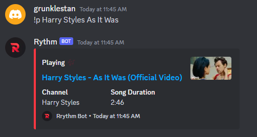
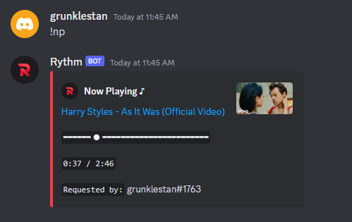
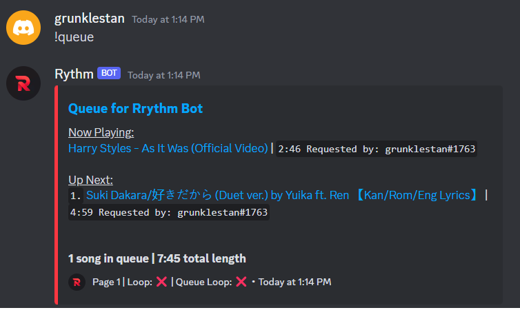

# Rrythm Discord Music Bot
> node.js Rythm (note the spelling) clone, replicating essential fetaures for in-call music entertainment





## Prerequisites
Install NPM packages
```
npm i
```
Start the program
```
node .
```
Run the program through a Python script to allow auto-restart on crash/disconnect
```
python3 Launch.py
```

## Docs/Usage
### `!clear`
Clears the music player queue

### `!disconnect` or `!dc`
Disconnects the bot from the voice call

### `!loop`
Loop the currently playing song (not the queue)

### `!nowplaying` or `!np`
Displays the song that is currently playing

### `!pause`
Pause the music player

### `!play` or `!p` (multiple uses)
1. Without any parameters - Toggle music player play/pause
```
!play
```

2. With a `YouTube video URL` as a parameter - Add the song to the queue
```
!play https://www.youtube.com/watch?v=dQw4w9WgXcQ
```

3. With a `search keyword` - Adds the returned search result to the queue
```
!play joji glimpse of us
```

4. With a playlist URL

### `!playtop` or `!ptop`
With a `search keyword` or `YouTube URL`, add the returned search result to the top of the queue
```
!playtop https://www.youtube.com/watch?v=dQw4w9WgXcQ
!playtop joji glimpse of us
```

### `!queue` or `!q`   
Displays the list of songs that are currently in queue

### `!remove`
Remove a queued video, based on a given index, from the music player queue. 
<br>
The following example demonstrates removing the 4th item from the queue
```
!remove 4
```

### `!skip` or `!s`
Skip the currently playing song

## Technologies Used
* [Discord.js](https://discord.js.org/)
* [Discord.js/voice](https://discordjs.guide/voice/) and dependencies
* [play-dl](https://www.npmjs.com/package/play-dl)

## Feature Roadmap
- [ ] Investigate playback stability
- [ ] Add a shuffle feature
- [ ] Investigate playlist stability
- [ ] Implement lyrics lookup
- [ ] Incorporate slash commands into bot usage
- [ ] Remove Discord tag retrieval due to depreciation

# Demo
Coming soon...